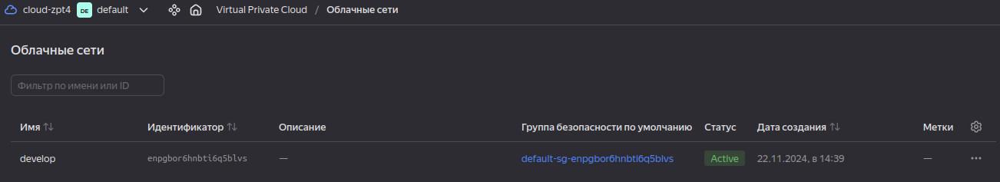
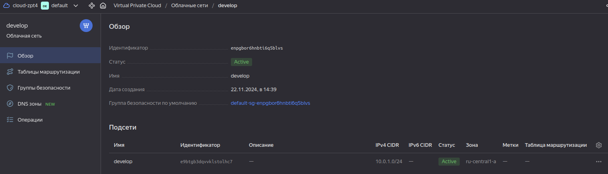
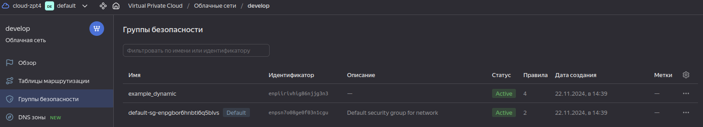
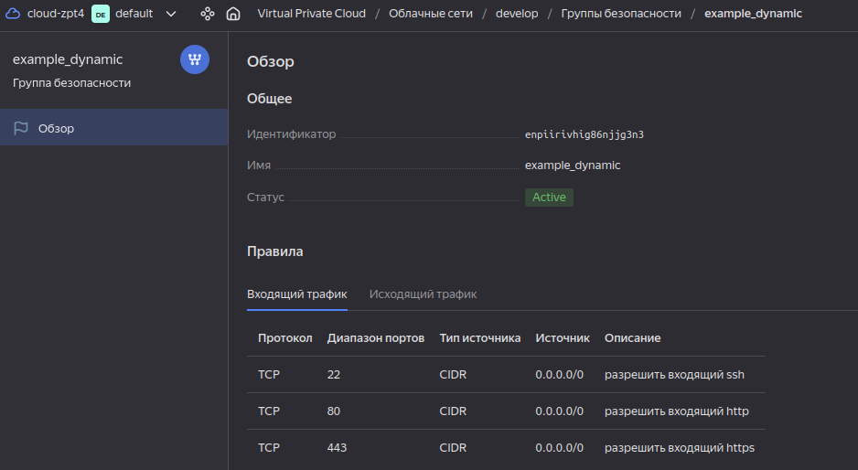

# Домашнее задание к занятию «Управляющие конструкции в коде Terraform»
### Задание 1

1. Изучите проект.
2. Заполните файл personal.auto.tfvars.
3. Инициализируйте проект, выполните код. 


Приложите скриншот входящих правил «Группы безопасности» в ЛК Yandex Cloud .

### Решение задания 1
Инициализировал проект, выполнил код










### Задание 2

1. Создайте файл count-vm.tf. Опишите в нём создание двух **одинаковых** ВМ  web-1 и web-2 (не web-0 и web-1) с минимальными параметрами, используя мета-аргумент **count loop**. Назначьте ВМ созданную в первом задании группу безопасности.(как это сделать узнайте в документации провайдера yandex/compute_instance )
2. Создайте файл for_each-vm.tf. Опишите в нём создание двух ВМ для баз данных с именами "main" и "replica" **разных** по cpu/ram/disk_volume , используя мета-аргумент **for_each loop**. Используйте для обеих ВМ одну общую переменную типа:
```
variable "each_vm" {
  type = list(object({  vm_name=string, cpu=number, ram=number, disk_volume=number }))
}
```  
При желании внесите в переменную все возможные параметры.
4. ВМ из пункта 2.1 должны создаваться после создания ВМ из пункта 2.2.
5. Используйте функцию file в local-переменной для считывания ключа ~/.ssh/id_rsa.pub и его последующего использования в блоке metadata, взятому из ДЗ 2.
6. Инициализируйте проект, выполните код.

### Решение задания 2
Выполнил все пункты задания, инициализировал проект, выполнил код

count-vm.tf
```
#все переменные находятся в variables.tf

resource "yandex_compute_instance" "develop" {

  count = var.vm_web_quantity

  name        = "netology-develop-platform-web-${count.index+1}"
  hostname    = "netology-develop-platform-web-${count.index+1}"
  platform_id = "standard-v1"

  resources {
    cores         = var.vm_web_cores
    memory        = var.vm_web_memory
    core_fraction = var.vm_web_fraction
  }

  boot_disk {
    initialize_params {
      image_id = data.yandex_compute_image.ubuntu-2004-lts.image_id
      type     = var.vm_web_boot_disk_type
      size     = var.vm_web_boot_disk_size
    }
  }

  metadata = {
    ssh-keys = "ubuntu:${var.public_key}"
  }

  scheduling_policy { preemptible = var.vm_web_preemptible }

  network_interface {
    subnet_id = yandex_vpc_subnet.develop.id
    nat       = var.vm_web_network_interface_nat
    security_group_ids = [
       yandex_vpc_security_group.example.id
    ]
  }
  allow_stopping_for_update = var.vm_web_allow_stopping_for_update
}
```

for_each-vm.tf
```
#все переменные находятся в variables.tf

resource "yandex_compute_instance" "for_each" {
  depends_on = [yandex_compute_instance.develop]
  for_each = { for i in var.vm_for_each_list : i.vm_name => i }
  name = each.value.vm_name

  platform_id = each.value.platform_id
  resources {
    cores = each.value.cpu
    memory = each.value.ram

  }
  boot_disk {
    initialize_params {
      image_id = data.yandex_compute_image.ubuntu-2004-lts.image_id
      size = each.value.disk_volume
    }
  }

    metadata = {
    ssh-keys = "ubuntu:${local.ssh-keys}"
    serial-port-enable = var.for_each_serial-port-enable
  }

  network_interface {
    subnet_id = yandex_vpc_subnet.develop.id
    nat = var.for_each_network_interface_nat
    security_group_ids = [
      yandex_vpc_security_group.example.id
    ]
  }
  scheduling_policy {
    preemptible = var.for_each_preemptible
  }
}
```

### Задание 3

1. Создайте 3 одинаковых виртуальных диска размером 1 Гб с помощью ресурса yandex_compute_disk и мета-аргумента count в файле **disk_vm.tf** .
2. Создайте в том же файле **одиночную**(использовать count или for_each запрещено из-за задания №4) ВМ c именем "storage"  . Используйте блок **dynamic secondary_disk{..}** и мета-аргумент for_each для подключения созданных вами дополнительных дисков.

### Решение задания 3
Выполнил все пункты задания, инициализировал проект, выполнил код

disk-vm.tf


```
#все переменные находятся в variables.tf

resource "yandex_compute_disk" "storage" {
  count = var.storage_secondary_disk[0].count
  type  = var.storage_secondary_disk[0].type
  size  = var.storage_secondary_disk[0].size
  block_size  = var.storage_secondary_disk[0].block_size
  name  = "${var.storage_secondary_disk[0].name}-${count.index}"
}


resource "yandex_compute_instance" "storage" {
  name = var.vm_storage.name
  zone = var.vm_storage.zone

  resources {
    cores  = var.vm_storage.cores
    memory = var.vm_storage.memory
    core_fraction = var.vm_storage.fraction
  }

  boot_disk {
    initialize_params {
      image_id = data.yandex_compute_image.ubuntu-2004-lts.image_id
      type     = var.boot_disk_vm_storage.type
      size     = var.boot_disk_vm_storage.size
    }
  }
      metadata = {
      ssh-keys           = "ubuntu:${local.ssh-keys}"
      serial-port-enable = var.vm_storage_serial-port-enable
    }
  network_interface {
    subnet_id = yandex_vpc_subnet.develop.id
    nat       = var.vm_storage_network_interface_nat
    security_group_ids = [
      yandex_vpc_security_group.example.id
    ]
  }
  scheduling_policy {
    preemptible = var.vm_storage_preemptible
  }
  dynamic "secondary_disk" {
    for_each = yandex_compute_disk.storage.*.id
    content {
      disk_id = secondary_disk.value
  }
  }
}
```

### Задание 4

1. В файле ansible.tf создайте inventory-файл для ansible.
Используйте функцию tepmplatefile и файл-шаблон для создания ansible inventory-файла из лекции.
Готовый код возьмите из демонстрации к лекции [**demonstration2**](https://github.com/netology-code/ter-homeworks/tree/main/03/demo).
Передайте в него в качестве переменных группы виртуальных машин из задания 2.1, 2.2 и 3.2, т. е. 5 ВМ.
2. Инвентарь должен содержать 3 группы и быть динамическим, т. е. обработать как группу из 2-х ВМ, так и 999 ВМ.
3. Добавьте в инвентарь переменную  [**fqdn**](https://cloud.yandex.ru/docs/compute/concepts/network#hostname).
``` 
[webservers]
web-1 ansible_host=<внешний ip-адрес> fqdn=<полное доменное имя виртуальной машины>
web-2 ansible_host=<внешний ip-адрес> fqdn=<полное доменное имя виртуальной машины>

[databases]
main ansible_host=<внешний ip-адрес> fqdn=<полное доменное имя виртуальной машины>
replica ansible_host<внешний ip-адрес> fqdn=<полное доменное имя виртуальной машины>

[storage]
storage ansible_host=<внешний ip-адрес> fqdn=<полное доменное имя виртуальной машины>
```
Пример fqdn: ```web1.ru-central1.internal```(в случае указания переменной hostname(не путать с переменной name)); ```fhm8k1oojmm5lie8i22a.auto.internal```(в случае отсутвия перменной hostname - автоматическая генерация имени,  зона изменяется на auto). нужную вам переменную найдите в документации провайдера или terraform console.
4. Выполните код. Приложите скриншот получившегося файла. 

Для общего зачёта создайте в вашем GitHub-репозитории новую ветку terraform-03. Закоммитьте в эту ветку свой финальный код проекта, пришлите ссылку на коммит.   
**Удалите все созданные ресурсы**.

### Решение задания 4
Выполнил все пункты задания, инициализировал проект, выполнил код

ansible.tf

```
resource "local_file" "hosts_cfg" {
  content = templatefile("${path.module}/hosts.tftpl",
   {webservers =  yandex_compute_instance.develop
    databases = yandex_compute_instance.for_each
    storage = [yandex_compute_instance.storage]}
  )
  filename = "${abspath(path.module)}/hosts.cfg"
}
```

hosts.tftpl
```
[webservers]

%{~ for i in webservers ~}

${i["name"]}   ansible_host=${i["network_interface"][0]["nat_ip_address"]} fqdn=${i["name"]}.${i["zone"]}.internal

%{~ endfor ~}


[databases]

%{~ for i in databases ~}

${i["name"]}   ansible_host=${i["network_interface"][0]["nat_ip_address"]} fqdn=${i["name"]}.${i["zone"]}.internal

%{~ endfor ~}


[storage]

%{~ for i in storage ~}

${i["name"]}   ansible_host=${i["network_interface"][0]["nat_ip_address"]} fqdn=${i["name"]}.${i["zone"]}.internal

%{~ endfor ~}

```
