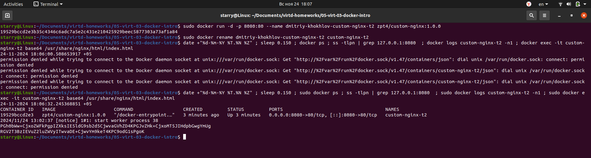

# Домашнее задание к занятию 4 «Оркестрация группой Docker контейнеров на примере Docker Compose»

### Инструкция к выполению

1. Для выполнения заданий обязательно ознакомьтесь с [инструкцией](https://github.com/netology-code/devops-materials/blob/master/cloudwork.MD) по экономии облачных ресурсов. Это нужно, чтобы не расходовать средства, полученные в результате использования промокода.
2. Практические задачи выполняйте на личной рабочей станции или созданной вами ранее ВМ в облаке.
3. Своё решение к задачам оформите в вашем GitHub репозитории в формате markdown!!!
4. В личном кабинете отправьте на проверку ссылку на .md-файл в вашем репозитории.

## Задача 1

Сценарий выполнения задачи:
- Установите docker и docker compose plugin на свою linux рабочую станцию или ВМ.
- Если dockerhub недоступен создайте файл /etc/docker/daemon.json с содержимым: ```{"registry-mirrors": ["https://mirror.gcr.io", "https://daocloud.io", "https://c.163.com/", "https://registry.docker-cn.com"]}```
- Зарегистрируйтесь и создайте публичный репозиторий  с именем "custom-nginx" на https://hub.docker.com (ТОЛЬКО ЕСЛИ У ВАС ЕСТЬ ДОСТУП);
- скачайте образ nginx:1.21.1;
- Создайте Dockerfile и реализуйте в нем замену дефолтной индекс-страницы(/usr/share/nginx/html/index.html), на файл index.html с содержимым:
```
<html>
<head>
Hey, Netology
</head>
<body>
<h1>I will be DevOps Engineer!</h1>
</body>
</html>
```
- Соберите и отправьте созданный образ в свой dockerhub-репозитории c tag 1.0.0 (ТОЛЬКО ЕСЛИ ЕСТЬ ДОСТУП). 
- Предоставьте ответ в виде ссылки на https://hub.docker.com/<username_repo>/custom-nginx/general .

### Решение задачи 1
Выполнил все пункты задания, [ответ](https://hub.docker.com/r/zpt4/custom-nginx/tags) 

## Задача 2
1. Запустите ваш образ custom-nginx:1.0.0 командой docker run в соответвии с требованиями:
- имя контейнера "ФИО-custom-nginx-t2"
- контейнер работает в фоне
- контейнер опубликован на порту хост системы 127.0.0.1:8080
2. Не удаляя, переименуйте контейнер в "custom-nginx-t2"
3. Выполните команду ```date +"%d-%m-%Y %T.%N %Z" ; sleep 0.150 ; docker ps ; ss -tlpn | grep 127.0.0.1:8080  ; docker logs custom-nginx-t2 -n1 ; docker exec -it custom-nginx-t2 base64 /usr/share/nginx/html/index.html```
4. Убедитесь с помощью curl или веб браузера, что индекс-страница доступна.

В качестве ответа приложите скриншоты консоли, где видно все введенные команды и их вывод.

### Решение задачи 2
Выполнил все пункты задания:


## Задача 3
1. Воспользуйтесь docker help или google, чтобы узнать как подключиться к стандартному потоку ввода/вывода/ошибок контейнера "custom-nginx-t2".
2. Подключитесь к контейнеру и нажмите комбинацию Ctrl-C.
3. Выполните ```docker ps -a``` и объясните своими словами почему контейнер остановился.
4. Перезапустите контейнер
5. Зайдите в интерактивный терминал контейнера "custom-nginx-t2" с оболочкой bash.
6. Установите любимый текстовый редактор(vim, nano итд) с помощью apt-get.
7. Отредактируйте файл "/etc/nginx/conf.d/default.conf", заменив порт "listen 80" на "listen 81".
8. Запомните(!) и выполните команду ```nginx -s reload```, а затем внутри контейнера ```curl http://127.0.0.1:80 ; curl http://127.0.0.1:81```.
9. Выйдите из контейнера, набрав в консоли  ```exit``` или Ctrl-D.
10. Проверьте вывод команд: ```ss -tlpn | grep 127.0.0.1:8080``` , ```docker port custom-nginx-t2```, ```curl http://127.0.0.1:8080```. Кратко объясните суть возникшей проблемы.
11. * Это дополнительное, необязательное задание. Попробуйте самостоятельно исправить конфигурацию контейнера, используя доступные источники в интернете. Не изменяйте конфигурацию nginx и не удаляйте контейнер. Останавливать контейнер можно. [пример источника](https://www.baeldung.com/linux/assign-port-docker-container)
12. Удалите запущенный контейнер "custom-nginx-t2", не останавливая его.(воспользуйтесь --help или google)

В качестве ответа приложите скриншоты консоли, где видно все введенные команды и их вывод.

### Решение задачи 3
Выполнил все пункты задания. При запуске контейнера пробрасывается порт 8080 на порт 80, на котором слушает nginx. При замене порта 80 на 81 в nginx, снаружи, соответственно, проброс порта перестает работать. 

```
starry@Linux:~/Documents/virtd-homeworks/05-virt-03-docker-intro$ sudo docker run -d -p 8080:80 --name custom-nginx-t2 zpt4/custom-nginx:1.0.0
e031956342acd6f0cc1013ef397e8a77eb93004b65cf75579d3a1168131738de
starry@Linux:~/Documents/virtd-homeworks/05-virt-03-docker-intro$ sudo docker attach custom-nginx-t2
^C2024/11/24 16:51:54 [notice] 1#1: signal 2 (SIGINT) received, exiting
2024/11/24 16:51:54 [notice] 31#31: exiting
2024/11/24 16:51:54 [notice] 33#33: exiting
2024/11/24 16:51:54 [notice] 35#35: exiting
2024/11/24 16:51:54 [notice] 37#37: exiting
2024/11/24 16:51:54 [notice] 34#34: exiting
2024/11/24 16:51:54 [notice] 32#32: exiting
2024/11/24 16:51:54 [notice] 35#35: exit
2024/11/24 16:51:54 [notice] 34#34: exit
2024/11/24 16:51:54 [notice] 33#33: exit
2024/11/24 16:51:54 [notice] 31#31: exit
2024/11/24 16:51:54 [notice] 32#32: exit
2024/11/24 16:51:54 [notice] 38#38: exiting
2024/11/24 16:51:54 [notice] 36#36: exiting
2024/11/24 16:51:54 [notice] 37#37: exit
2024/11/24 16:51:54 [notice] 38#38: exit
2024/11/24 16:51:54 [notice] 36#36: exit
2024/11/24 16:51:54 [notice] 1#1: signal 17 (SIGCHLD) received from 32
2024/11/24 16:51:54 [notice] 1#1: worker process 32 exited with code 0
2024/11/24 16:51:54 [notice] 1#1: signal 29 (SIGIO) received
2024/11/24 16:51:55 [notice] 1#1: signal 17 (SIGCHLD) received from 34
2024/11/24 16:51:55 [notice] 1#1: worker process 34 exited with code 0
2024/11/24 16:51:55 [notice] 1#1: worker process 38 exited with code 0
2024/11/24 16:51:55 [notice] 1#1: signal 29 (SIGIO) received
2024/11/24 16:51:55 [notice] 1#1: signal 17 (SIGCHLD) received from 31
2024/11/24 16:51:55 [notice] 1#1: worker process 31 exited with code 0
2024/11/24 16:51:55 [notice] 1#1: signal 29 (SIGIO) received
2024/11/24 16:51:55 [notice] 1#1: signal 17 (SIGCHLD) received from 37
2024/11/24 16:51:55 [notice] 1#1: worker process 37 exited with code 0
2024/11/24 16:51:55 [notice] 1#1: signal 29 (SIGIO) received
2024/11/24 16:51:55 [notice] 1#1: signal 17 (SIGCHLD) received from 35
2024/11/24 16:51:55 [notice] 1#1: worker process 35 exited with code 0
2024/11/24 16:51:55 [notice] 1#1: signal 29 (SIGIO) received
2024/11/24 16:51:55 [notice] 1#1: signal 17 (SIGCHLD) received from 36
2024/11/24 16:51:55 [notice] 1#1: worker process 36 exited with code 0
2024/11/24 16:51:55 [notice] 1#1: signal 29 (SIGIO) received
2024/11/24 16:51:55 [notice] 1#1: signal 17 (SIGCHLD) received from 33
2024/11/24 16:51:55 [notice] 1#1: worker process 33 exited with code 0
2024/11/24 16:51:55 [notice] 1#1: exit
starry@Linux:~/Documents/virtd-homeworks/05-virt-03-docker-intro$ sudo docker remove custom-nginx-t2
custom-nginx-t2
starry@Linux:~/Documents/virtd-homeworks/05-virt-03-docker-intro$ sudo docker run -d -p 8080:80 --name custom-nginx-t2 zpt4/custom-nginx:1.0.0
b4795a5fff8350779bc10533ed9f3ee6d61c539f433588d2085e9aa8a2e1b01c
starry@Linux:~/Documents/virtd-homeworks/05-virt-03-docker-intro$ sudo docker exec -it custom-nginx-t2 /bin/bash
root@b4795a5fff83:/# nginx -s reload
2024/11/24 16:55:35 [notice] 634#634: signal process started
root@b4795a5fff83:/# curl http://127.0.0.1:80
curl: (7) Failed to connect to 127.0.0.1 port 80: Connection refused
root@b4795a5fff83:/# curl http://127.0.0.1:81
<html>
<head>
Hey, Netology
</head>
<body>
<h1>I will be DevOps Engineer!</h1>
</body>
</html>

root@b4795a5fff83:/# exit
exit
starry@Linux:~/Documents/virtd-homeworks/05-virt-03-docker-intro$ ss -tlpn | grep 127.0.0.1:8080
starry@Linux:~/Documents/virtd-homeworks/05-virt-03-docker-intro$ sudo docker port custom-nginx-t2
80/tcp -> 0.0.0.0:8080
80/tcp -> [::]:8080
starry@Linux:~/Documents/virtd-homeworks/05-virt-03-docker-intro$ curl http://127.0.0.1:8080
curl: (56) Recv failure: Connection reset by peer
starry@Linux:~/Documents/virtd-homeworks/05-virt-03-docker-intro$ sudo docker kill custom-nginx-t2
custom-nginx-t2
```

## Задача 4

- Запустите первый контейнер из образа ***centos*** c любым тегом в фоновом режиме, подключив папку  текущий рабочий каталог ```$(pwd)``` на хостовой машине в ```/data``` контейнера, используя ключ -v.
- Запустите второй контейнер из образа ***debian*** в фоновом режиме, подключив текущий рабочий каталог ```$(pwd)``` в ```/data``` контейнера. 
- Подключитесь к первому контейнеру с помощью ```docker exec``` и создайте текстовый файл любого содержания в ```/data```.
- Добавьте ещё один файл в текущий каталог ```$(pwd)``` на хостовой машине.
- Подключитесь во второй контейнер и отобразите листинг и содержание файлов в ```/data``` контейнера.

В качестве ответа приложите скриншоты консоли, где видно все введенные команды и их вывод.

### Решение задачи 4
Выполнил все пункты задания.
```
starry@Linux:~/Documents/virtd-homeworks/05-virt-03-docker-intro$ sudo docker run -t -d -v $(pwd):/data --network host --name vm_centos centos
4fafb71d4689fdfa50399bbbc92ea81ac8a458e3d62e292eafbda532ad1b23dd
starry@Linux:~/Documents/virtd-homeworks/05-virt-03-docker-intro$ sudo docker run -t -d -v $(pwd):/data --network host --name vm_debian debian
5660568b711b6b85bf7900d6f221ef7a392ac3e21af5bc882669ca2c6b41e047
starry@Linux:~/Documents/virtd-homeworks/05-virt-03-docker-intro$ sudo docker exec -it vm_centos /bin/bash
[root@Linux /]# cd data
[root@Linux data]# ls
Dockerfile
[root@Linux data]# touch shared-file.txt
[root@Linux data]# ls
Dockerfile  shared-file.txt
[root@Linux data]# exit
exit
starry@Linux:~/Documents/virtd-homeworks/05-virt-03-docker-intro$ touch shared-file-host.txt
starry@Linux:~/Documents/virtd-homeworks/05-virt-03-docker-intro$ ls
Dockerfile  shared-file-host.txt  shared-file.txt
starry@Linux:~/Documents/virtd-homeworks/05-virt-03-docker-intro$ sudo docker exec -it vm_debian /bin/bash
root@Linux:/# cd data
root@Linux:/data# ls
Dockerfile  shared-file-host.txt  shared-file.txt
root@Linux:/data# exit
exit
starry@Linux:~/Documents/virtd-homeworks/05-virt-03-docker-intro$ 
```

## Задача 5

1. Создайте отдельную директорию(например /tmp/netology/docker/task5) и 2 файла внутри него.
"compose.yaml" с содержимым:
```
version: "3"
services:
  portainer:
    network_mode: host
    image: portainer/portainer-ce:latest
    volumes:
      - /var/run/docker.sock:/var/run/docker.sock
```
"docker-compose.yaml" с содержимым:
```
version: "3"
services:
  registry:
    image: registry:2

    ports:
    - "5000:5000"
```

И выполните команду "docker compose up -d". Какой из файлов был запущен и почему? (подсказка: https://docs.docker.com/compose/compose-application-model/#the-compose-file )

2. Отредактируйте файл compose.yaml так, чтобы были запущенны оба файла. (подсказка: https://docs.docker.com/compose/compose-file/14-include/)

3. Выполните в консоли вашей хостовой ОС необходимые команды чтобы залить образ custom-nginx как custom-nginx:latest в запущенное вами, локальное registry. Дополнительная документация: https://distribution.github.io/distribution/about/deploying/
4. Откройте страницу "https://127.0.0.1:9000" и произведите начальную настройку portainer.(логин и пароль адмнистратора)
5. Откройте страницу "http://127.0.0.1:9000/#!/home", выберите ваше local  окружение. Перейдите на вкладку "stacks" и в "web editor" задеплойте следующий компоуз:

```
version: '3'

services:
  nginx:
    image: 127.0.0.1:5000/custom-nginx
    ports:
      - "9090:80"
```
6. Перейдите на страницу "http://127.0.0.1:9000/#!/2/docker/containers", выберите контейнер с nginx и нажмите на кнопку "inspect". В представлении <> Tree разверните поле "Config" и сделайте скриншот от поля "AppArmorProfile" до "Driver".

7. Удалите любой из манифестов компоуза(например compose.yaml).  Выполните команду "docker compose up -d". Прочитайте warning, объясните суть предупреждения и выполните предложенное действие. Погасите compose-проект ОДНОЙ(обязательно!!) командой.

В качестве ответа приложите скриншоты консоли, где видно все введенные команды и их вывод, файл compose.yaml , скриншот portainer c задеплоенным компоузом.

### Решение задачи 5
Выполнил все пункты задания.

```
starry@Linux:~/Documents/virtd-homeworks/05-virt-03-docker-intro/ex5$ sudo docker compose up -d
WARN[0000] Found multiple config files with supported names: /home/starry/Documents/virtd-homeworks/05-virt-03-docker-intro/ex5/compose.yaml, /home/starry/Documents/virtd-homeworks/05-virt-03-docker-intro/ex5/docker-compose.yaml 
WARN[0000] Using /home/starry/Documents/virtd-homeworks/05-virt-03-docker-intro/ex5/compose.yaml 
WARN[0000] /home/starry/Documents/virtd-homeworks/05-virt-03-docker-intro/ex5/compose.yaml: the attribute `version` is obsolete, it will be ignored, please remove it to avoid potential confusion 
[+] Running 12/12
 ✔ portainer Pulled                                                                                                                                               18.7s 
   ✔ 2a8c27161aa3 Pull complete                                                                                                                                    1.0s 
   ✔ 679061c2c821 Pull complete                                                                                                                                    1.0s 
   ✔ d40df14c1d7a Pull complete                                                                                                                                    4.4s 
   ✔ 8215717c7c10 Pull complete                                                                                                                                    8.0s 
   ✔ 542669febe7c Pull complete                                                                                                                                   10.2s 
   ✔ 6c27c7f45b54 Pull complete                                                                                                                                   10.4s 
   ✔ 070d3bf2528e Pull complete                                                                                                                                   10.4s 
   ✔ 846480e9f8b0 Pull complete                                                                                                                                   11.9s 
   ✔ c7053d7d4c2a Pull complete                                                                                                                                   15.2s 
   ✔ a2ed6de7fb5f Pull complete                                                                                                                                   15.2s 
   ✔ 4f4fb700ef54 Pull complete                                                                                                                                   15.2s 
[+] Running 1/1
 ✔ Container ex5-portainer-1  Started                                                                                                                              0.2s 
starry@Linux:~/Documents/virtd-homeworks/05-virt-03-docker-intro/ex5$ sudo docker compose up -d
WARN[0000] Found multiple config files with supported names: /home/starry/Documents/virtd-homeworks/05-virt-03-docker-intro/ex5/compose.yaml, /home/starry/Documents/virtd-homeworks/05-virt-03-docker-intro/ex5/docker-compose.yaml 
WARN[0000] Using /home/starry/Documents/virtd-homeworks/05-virt-03-docker-intro/ex5/compose.yaml 
WARN[0000] /home/starry/Documents/virtd-homeworks/05-virt-03-docker-intro/ex5/docker-compose.yaml: the attribute `version` is obsolete, it will be ignored, please remove it to avoid potential confusion 
WARN[0000] /home/starry/Documents/virtd-homeworks/05-virt-03-docker-intro/ex5/compose.yaml: the attribute `version` is obsolete, it will be ignored, please remove it to avoid potential confusion 
[+] Running 6/6
 ✔ registry Pulled                                                                                                                                                 5.6s 
   ✔ dc0decf4841d Pull complete                                                                                                                                    1.7s 
   ✔ 6cb0aa443e23 Pull complete                                                                                                                                    1.8s 
   ✔ 813676e291ef Pull complete                                                                                                                                    2.1s 
   ✔ dc2fb7dcec61 Pull complete                                                                                                                                    2.1s 
   ✔ 916205650bfe Pull complete                                                                                                                                    2.4s 
[+] Running 3/3
 ✔ Network ex5_default        Created                                                                                                                              0.0s 
 ✔ Container ex5-portainer-1  Started                                                                                                                              0.1s 
 ✔ Container ex5-registry-1   Started                                                                                                                              0.3s 
starry@Linux:~/Documents/virtd-homeworks/05-virt-03-docker-intro/ex5$ sudo docker tag custom-nginx:1.0.0 localhost:5000/custom-nginx
starry@Linux:~/Documents/virtd-homeworks/05-virt-03-docker-intro/ex5$ sudo docker push localhost:5000/custom-nginx
Using default tag: latest
The push refers to repository [localhost:5000/custom-nginx]
cb4510b01292: Pushed 
d47e4d19ddec: Pushed 
8e58314e4a4f: Pushed 
ed94af62a494: Pushed 
875b5b50454b: Pushed 
63b5f2c0d071: Pushed 
d000633a5681: Pushed 
latest: digest: sha256:0621ba39d85faaf15cc823ad2468af6fc2bd091a7a98457beff581fca5804832 size: 1777
starry@Linux:~/Documents/virtd-homeworks/05-virt-03-docker-intro/ex5$ sudo docker compose down
WARN[0000] Found multiple config files with supported names: /home/starry/Documents/virtd-homeworks/05-virt-03-docker-intro/ex5/compose.yaml, /home/starry/Documents/virtd-homeworks/05-virt-03-docker-intro/ex5/docker-compose.yaml 
WARN[0000] Using /home/starry/Documents/virtd-homeworks/05-virt-03-docker-intro/ex5/compose.yaml 
WARN[0000] /home/starry/Documents/virtd-homeworks/05-virt-03-docker-intro/ex5/docker-compose.yaml: the attribute `version` is obsolete, it will be ignored, please remove it to avoid potential confusion 
WARN[0000] /home/starry/Documents/virtd-homeworks/05-virt-03-docker-intro/ex5/compose.yaml: the attribute `version` is obsolete, it will be ignored, please remove it to avoid potential confusion 
[+] Running 3/3
 ✔ Container ex5-registry-1   Removed                                                                                                                              0.2s 
 ✔ Container ex5-portainer-1  Removed                                                                                                                              0.1s 
 ✔ Network ex5_default        Removed                                                                                                                              0.1s 
starry@Linux:~/Documents/virtd-homeworks/05-virt-03-docker-intro/ex5$ sudo docker compose up -d
WARN[0000] /home/starry/Documents/virtd-homeworks/05-virt-03-docker-intro/ex5/docker-compose.yaml: the attribute `version` is obsolete, it will be ignored, please remove it to avoid potential confusion 
WARN[0000] Found orphan containers ([ex5-portainer-1]) for this project. If you removed or renamed this service in your compose file, you can run this command with the --remove-orphans flag to clean it up. 
[+] Running 1/0
 ✔ Container ex5-registry-1  Running                                                                                                                               0.0s 
starry@Linux:~/Documents/virtd-homeworks/05-virt-03-docker-intro/ex5$ sudo docker compose kill
WARN[0000] /home/starry/Documents/virtd-homeworks/05-virt-03-docker-intro/ex5/docker-compose.yaml: the attribute `version` is obsolete, it will be ignored, please remove it to avoid potential confusion 
[+] Killing 1/1
 ✔ Container ex5-registry-1  Killed                                                                                                                                0.2s 
```

docker-compose.yaml

```
version: "3"
include:
  - docker-compose.yaml
services:
  portainer:
    network_mode: host
    image: portainer/portainer-ce:latest
    volumes:
      - /var/run/docker.sock:/var/run/docker.sock                    
```

